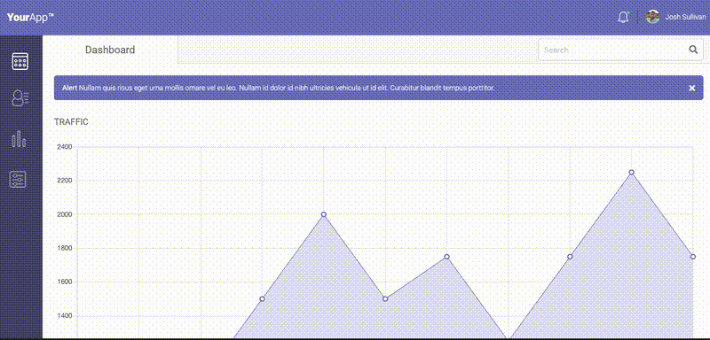

# Styling a Chart Dashboard
This was a very early-stage project in the Team Treehouse [Front-End Web Development Tech Degree](https://teamtreehouse.com/techdegree/front-end-web-development) program. I completed the program in 2019. [View my Certificate](https://www.credential.net/1700e85d-d29e-493d-a28e-a8c1860459c8#acc.PS7ITKNb)

The objective was to implement a given layout using Chart.js, HTML and CSS.

[Chart.js](https://www.chartjs.org/) is an open source HTML5 chart library.

[View Live Project](https://heidifryzell.com/fetd-project-7/)

## How It's Made:
### Tech Used:
  

## Optimizations

- The layout page needs to be refreshed in order to see the responsive layout correctly on mobile, should refresh on resize
- Some of the color choices might not be accessible, like inactive pill sliders

## Lessons Learned

I learned how to implement charts from the chart.js library.

## Related Projects
This repo was a dashboard-building exercise for a class at the beginning of my developer journey.

Here is my current portfolio:

<table border="1">
  <tr>
    <td style="text-align: center;"><a href="https://heidifryzell.com">heidifryzell.com</a></td>
  </tr>
  <tr>
    <td></td>
  </tr>
</table>
